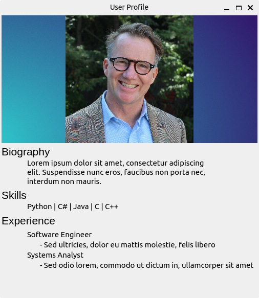

# User Profile
PyQt6 GUI to display user profile

### Image Credits

- Photo by <a href="https://unsplash.com/@maygauthier?utm_source=unsplash&utm_medium=referral&utm_content=creditCopyText">May Gauthier</a> on <a href="https://unsplash.com/s/photos/profile-picture?utm_source=unsplash&utm_medium=referral&utm_content=creditCopyText">Unsplash</a>
- Photo by <a href="https://unsplash.com/@lukechesser?utm_source=unsplash&utm_medium=referral&utm_content=creditCopyText">Luke Chesser</a> on <a href="https://unsplash.com/s/photos/background-blue?utm_source=unsplash&utm_medium=referral&utm_content=creditCopyText">Unsplash</a>
